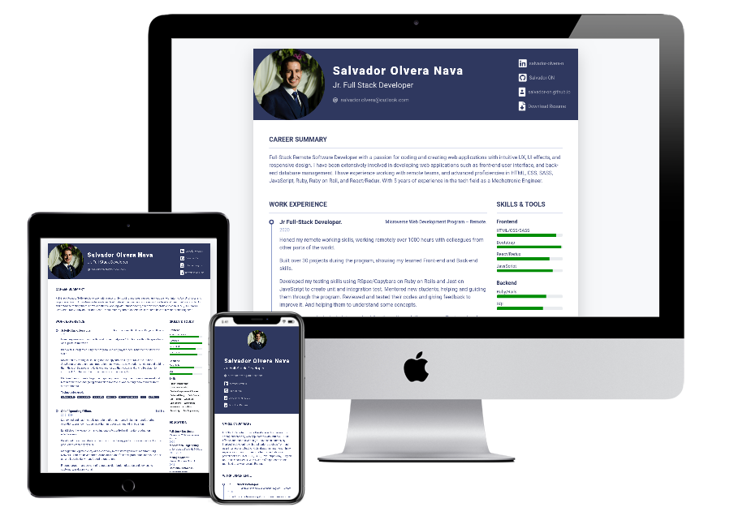

# Salvador-ON-Resume

Built it using HTML5, SASS, and Bootstrap.

## ScreenShots

## Live Version

Live version [here](https://salvador-on.github.io/Salvador-ON-Resume).

## Author

**Salvador Olvera**
- Linkedin: [Salvador Olvera](https://www.linkedin.com/in/salvador-olvera-n)
- Github: [@Salvador-ON](https://github.com/Salvador-ON)
- Twitter: [@Salvador Olvera_ON](https://twitter.com/Salvador_ON) 

## Used Tools

- HTML5.
- SASS.
- Bootstrap.

## Inspired and Guided by Xiaoying Riley
[Original Design](https://themes.3rdwavemedia.com/bootstrap-templates/resume/free-bootstrap4-resume-cv-template-for-developers-pillar/)

